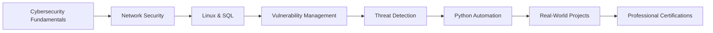

# 👋 Hey, I'm Macorley

### 🛡️ Aspiring Cybersecurity Professional | SOC Analyst | Security Automation Enthusiast

---

## 🚀 About Me

I'm passionate about cybersecurity and building tools that make security teams more effective. Currently completing the **Google Cybersecurity Professional Certificate** and developing AI-powered security automation projects.

- 🔐 Focused on **SOC operations, threat intelligence, and security automation**
- 🧠 Building **AI-powered tools** to solve real security challenges
- 📚 Continuous learner with hands-on approach to cybersecurity
- 🎯 Goal: Help organizations defend against evolving cyber threats

## 🛠️ Tech Stack & Tools

### Security Tools

### Programming & Scripting

### Frameworks & Technologies

### Operating Systems

---

## 🎯 Featured Projects

### 🤖 [AI-Powered Security Alert Triage Assistant](https://github.com/yourusername/ai-alert-triage-assistant)
Intelligent SOC automation tool that reduces analyst workload by 70% through ML-based risk scoring and automated threat intelligence enrichment.

**🔑 Key Features:**
- Real-time threat intelligence integration (VirusTotal, AbuseIPDB)
- ML-based risk scoring and false positive prediction
- MITRE ATT&CK framework mapping
- Automated investigation playbook generation

**💻 Tech:** Python, Flask, React, Scikit-learn, REST APIs

---

### 🧠 [Psychological Attack Pattern Recognition System](https://github.com/yourusername/psych-attack-detector)
Innovative threat detection system that analyzes the human thinking behind cyber attacks using game theory and behavioral analysis.

**🔑 Key Features:**
- Attacker decision tree inference using game theory
- Cultural attack signature analysis for APT attribution
- Cognitive load detection for social engineering prevention

**💻 Tech:** React, TailwindCSS, Behavioral Analytics

---

### 🔐 [More Projects Coming Soon...]
Currently working on:
- 🛡️ Shadow IT Discovery Engine
- 📊 Security Metrics Dashboard
- 🎣 Phishing Campaign Tracker

---

## 📊 GitHub Stats

  

---

## 🎓 Certifications & Learning

### 📜 Current Certifications
- 🔄 **Google Cybersecurity Professional Certificate** (In Progress - 6/8 completed)
  - ✅ Foundations of Cybersecurity
  - ✅ Play It Safe: Manage Security Risks
  - ✅ Connect and Protect: Networks and Network Security
  - ✅ Tools of the Trade: Linux and SQL
  - ✅ Assets, Threats, and Vulnerabilities
  - ✅ Sound the Alarm: Detection and Response
  - 🔄 Automate Cybersecurity Tasks with Python
  - ⏳ Put It to Work: Prepare for Cybersecurity Jobs

### 🎯 Next Up
- CompTIA Security+
- Certified Ethical Hacker (CEH)
- AWS Certified Security - Specialty

---

## 💡 Key Skills

<table>
<tr>
<td valign="top" width="50%">

#### Security Operations
- 🔍 Threat Detection & Analysis
- 🚨 Incident Response
- 📊 SIEM Tools & Log Analysis
- 🛡️ Vulnerability Management
- 🎯 Risk Assessment
- 📋 Security Documentation

</td>
<td valign="top" width="50%">

#### Technical Skills
- 🐍 Python for Security Automation
- 🐧 Linux System Administration
- 💾 SQL & Database Security
- 🌐 Network Security Analysis
- 🔐 Cryptography & PKI
- 🤖 AI/ML for Security

</td>
</tr>
</table>

---

## 📈 Learning Journey

---

## 🌟 What I'm Working On

- 🔨 Building production-ready security automation tools
- 📚 Deep diving into MITRE ATT&CK framework
- 🧪 Setting up home security lab (Splunk, Wazuh, ELK Stack)
- ✍️ Writing technical blog posts about SOC operations
- 🎯 Preparing for Security+ certification

---

## 📝 Latest Blog Posts

<!-- BLOG-POST-LIST:START -->
- 🔐 [How AI is Transforming SOC Operations](https://yourblog.com/ai-soc)
- 🎯 [MITRE ATT&CK Framework Explained](https://yourblog.com/mitre-attack)
- 🛡️ [Building Your First Security Automation Tool](https://yourblog.com/automation)
<!-- BLOG-POST-LIST:END -->

---

## 🤝 Let's Connect

I'm always open to discussing cybersecurity, collaborating on security projects, or just chatting about the latest threats!

---

## 💬 Quote I Live By

> *"The only truly secure system is one that is powered off, cast in a block of concrete and sealed in a lead-lined room with armed guards - and even then I have my doubts."* 
> 
> — Gene Spafford

---

## 📊 Contribution Activity

---

### 🌟 Thanks for stopping by! 

**⭐️ From [yourusername](https://github.com/yourusername) | Building the future of cybersecurity, one commit at a time**

